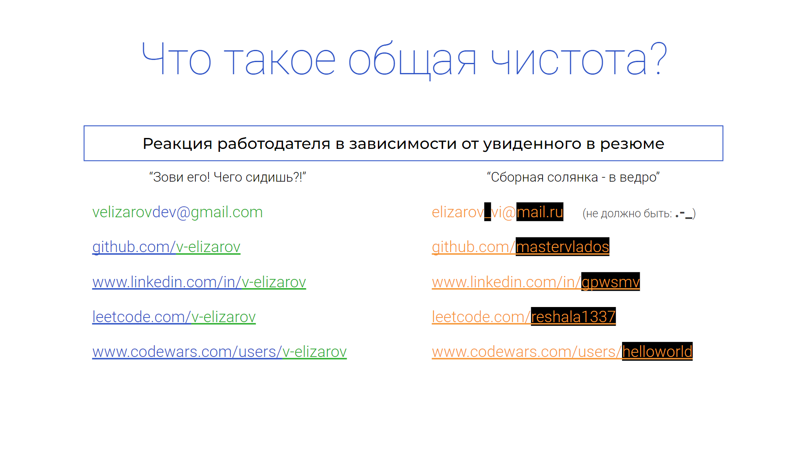
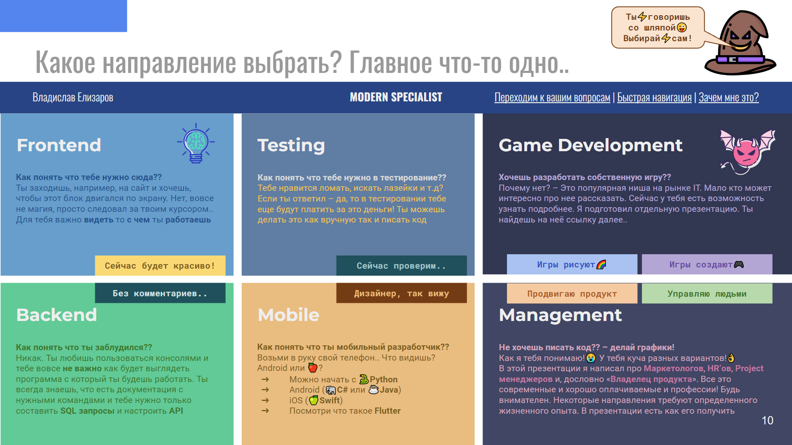
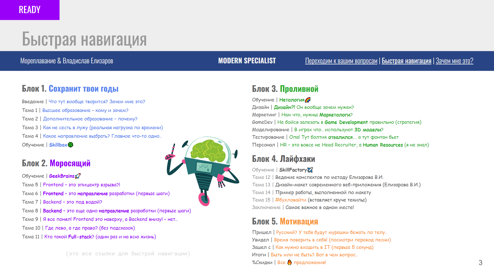
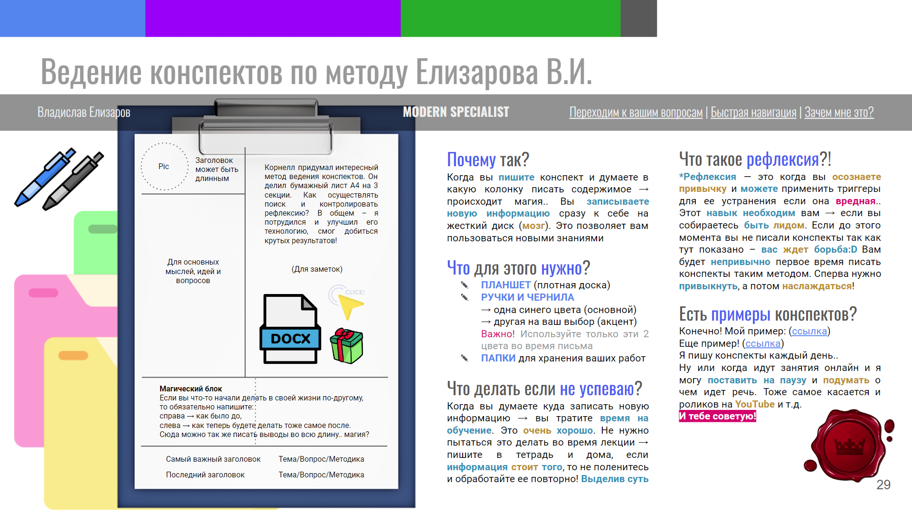

# Что такое IT? Куда они пытаются войти? Выбор направления/профессии и первого языка программирования

Привет! 

Я Владислав Елизаров,

в айти людям приходится говорить и довольно часто 

Буду рад на «ты» – просто Влад!

* [Что такое IT? Входят или становятся?](#что-такое-it-входят-или-становятся)
* [На что стоит обратить внимание в первую очередь?](#на-что-стоит-обратить-внимание-в-первую-очередь)
* [От чего будет зависеть твой финансовый успех?](#от-чего-будет-зависеть-твой-финансовый-успех)
* [Как стать востребованным IT-специалистом?](#как-стать-востребованным-it-специалистом)
* [Мой авторский курс «Современный специалист»](#мой-авторский-курс-«современный-специалист»)
* [Самое важное в одном месте (Заключение)](#самое-важное-в-одном-месте-заключение)

## Что такое IT? Входят или становятся?
")
## На что стоит обратить внимание в первую очередь?

## От чего будет зависеть твой финансовый успех?

## Как стать востребованным IT-специалистом?

## Мой авторский курс «Современный специалист»

## Самое важное в одном месте (Заключение)

_Благодарю, Влад_

[__English__]() | [__YouTube__](https://www.youtube.com/@gpwsmv)